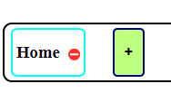
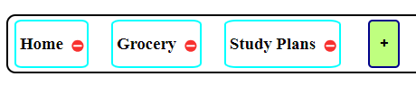
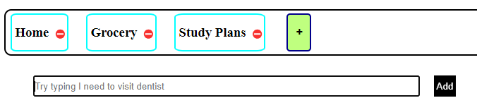
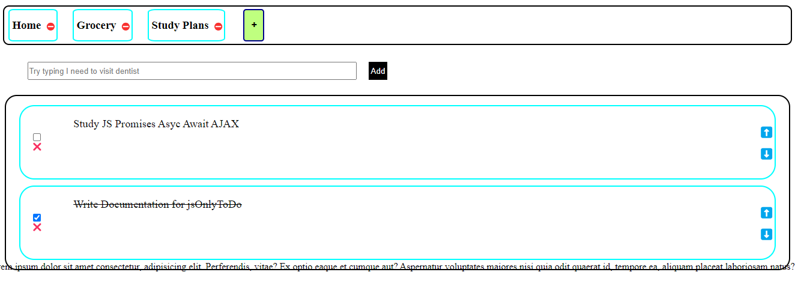
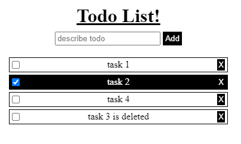

# To Do App using HTML CSS and JS

## Deployement :
[GitHub Pages](https://avy10.github.io/jsOnlyToDo/)

## Table of Contents
- [Summary](#Summary)
- [Pre-Requisites](#Pre-Requisites)
- [Usage](#Usage)
- [List of Broken Things](#List-of-Broken-Things)
- [List of Future Implementations](#List-of-Future-Implementations)
## Summary
This is a ToDo list webpage using HTML CSS and JS(only basic DOM). 
The ToDo list webpage has all the common functionality that you can expect from a To Do i.e. mark as complete, delete a ToDo, shuffle the order of list.
> **Note:** The webpage is not connected to any Database or local storage, refresing a page results in data loss.

## Pre-Requisites
For now the only requirement is a modern browser with JavaScript enabled.

## Usage

Initially, you can add a tab that allows you to organize related tasks.
For instance, a "Grocery" tab could contains your shopping list, and a "Study Plans" tab could contain your academic tasks. 

Navigating between tabs is straightforward—simply click on the tab corresponding to the To-Do list you wish to view.
To rename a tab, double-click on its name. 
To delete a tab, click on the ⛔ button. 
> **Note!** Keep in mind that, as of now, the "Home" tab cannot be deleted. This limitation is a temporary issue that will be addressed in a future update.

> **Note!** Better CSS for tabs is in the works.

To add a task in a tab, write the description of your task in the input field and either "Press Enter" or "click Add button". 
If you've entered a description but decided against adding it to the ToDo list, simply "press ESC" to discard it instantly.

Each ToDo Task has 4 buttons : CheckBox, ❌ (delete) button, ⬆️ moveUp button, ⬇️ moveDown button.
* To mark a task as completed, click on the CheckBox and, the task will be moved to the bottom of List.
* To delete a task permanently, click on the ❌ button.
* To mark a completed task as incompleted, click on the CheckBox again, and the task will be relocated to its last position, assuming no elements were deleted. Keep in mind that if tasks were completed and/or reordered, the positions will change accordingly and maybe in undesirable way. But you can always reorder a task.
* ### Reordering Tasks
  * To Move a task Up in the list, click on the ⬆️ button.
  * To Move a task Down in the list, click on the ⬇️ button.

## List-of-Broken-Things
* Lorem text at the bottom of ToDo tasks
* *Responsiveness*
* Home Tab cannot be deleted
* data loss upon refresh
* ~~add button is broken~~

## List-of-Future-Implementations
* fix List of Broken Things
* Implement New ToDo Button on top left
* Implement Dark Mode
* Write Better CSS with appealing styling and responsiveness
* Add a footer in place of Lorem text
* Maybe onDrag button for reordering a task
* Add an editable Task description with each task. for instance, the task "I need to visit dentist" could include description like "I need advisory on changing my toothpaste and, get the pain on top left teeth checked out."
* Maybe add TimeStamp to tasks, and Add Due date
* Implement Local Storage so that data wouldn't be lost on refresh.
* Use MERN on this project

## Project BrainStorming
* ### Source
    I got the idea for ToDo project when it was being discussed in-class by the instructor at Newton school. Check out the project here : https://codesandbox.io/p/sandbox/new-sea-dt8xzq

  
  

  After that I thought why not add a Tab feature to it, just like we have tabs on browser. The tabs would make it easier to organise related task. Once I added the tab feature.....
